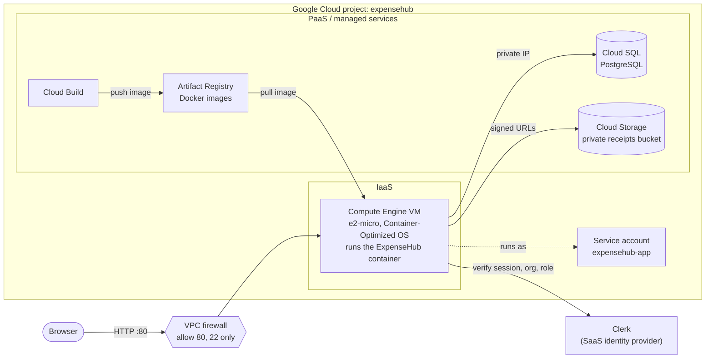
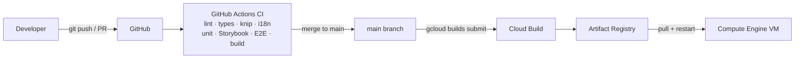

# ExpenseHub — Cloud Architecture

ExpenseHub is a multi-tenant SaaS expense tracker. Many organizations share one
deployed application and one database, yet each organization can only ever see
its own data. This document explains how the system is built on Google Cloud
Platform (GCP) and which cloud computing concepts each part demonstrates.

> **Deployment status:** the application, container image and cloud storage
> integration are complete. The GCP infrastructure described below is provisioned
> by the deployment script. Update this note once the live URL is available.

## 1. System overview

| Layer | What runs there | Who manages it |
|---|---|---|
| **SaaS** | ExpenseHub itself, delivered to organizations over the browser. Clerk, a SaaS identity provider, handles sign-in and organizations. | We build and operate ExpenseHub; Clerk operates identity |
| **PaaS** | Cloud SQL (PostgreSQL), Cloud Storage, Artifact Registry, Cloud Build | Google runs the servers, OS, patching and backups; we configure them |
| **IaaS** | Compute Engine VM, VPC network, firewall rules | Google provides virtual hardware; we manage the OS and what runs on it |

## 2. Multi-tenancy design

ExpenseHub uses the **shared database, shared schema** model: every row in the
`expense` table carries an `organization_id`, indexed for fast per-tenant queries.

- **The tenant always comes from the server-side session, never from the request.**
  `getExpenseTenant()` in `src/features/expenses/ExpenseTenant.ts` reads the user,
  active organization and role from Clerk's `auth()`. No form field or URL
  parameter can change which organization a request acts on.
- **All expense queries live in one module** (`ExpenseQueries.ts`) and all of them
  filter by `organization_id`.
- **Single-record operations match on id *and* organization.** Deleting expense
  `42` only succeeds if expense `42` belongs to the caller's organization, which
  prevents Insecure Direct Object Reference (IDOR) attacks by guessed ids.
- **Receipts are namespaced per tenant** in storage (`receipts/<orgId>/…`), and a
  receipt reference outside the caller's prefix is refused.

### Role-based access control

Roles come from Clerk organizations:

| Role | Sees | Can delete |
|---|---|---|
| `org:admin` | Every expense in the organization, and the organization-wide monthly summary | Any expense in the organization |
| `org:member` | Only the expenses they created, and their own monthly summary | Nothing |

Both checks run on the server in `ExpenseQueries.ts`, so hiding a button in the UI
is never the only protection.

## 3. Containerization

The application ships as a Docker image built by a **multi-stage `Dockerfile`**:

1. **dependencies**: installs all npm packages (`npm ci`).
2. **builder**: compiles the Next.js production build.
3. **runner**: a slim `node:24-bookworm-slim` image containing only production
   dependencies and the build output.

Secrets (`CLERK_SECRET_KEY`, `DATABASE_URL`) are **not baked into the image**. They
are injected as environment variables when the container starts, so the same
image runs in every environment.

In the cloud, **Cloud Build** builds the image from the repository and pushes it
to **Artifact Registry**. The VM pulls it from there, so no developer machine
needs Docker installed.

## 4. Storage

| Data | Service | Why |
|---|---|---|
| Expenses (structured, relational) | **Cloud SQL for PostgreSQL** | Managed relational database: Google handles patching, backups and storage |
| Receipt images (unstructured files) | **Cloud Storage**, private bucket | Durable object storage, cheap for files, independent of the VM's lifetime |

Receipt flow (`src/features/expenses/ReceiptStorage.ts`):

1. The file is validated on the server: JPG, PNG or WebP, at most 10 MB.
2. It is uploaded to `gs://<bucket>/receipts/<orgId>/<uuid>.<ext>`.
3. Only the `gs://` reference is stored in `expense.receipt_url`.
4. When the list is displayed, the server creates a **V4 signed URL valid for
   15 minutes**. The bucket itself is never public.

Without `GCS_BUCKET_NAME` (local development), receipts are written to local disk
instead. A container's local disk is lost when it is replaced, which is exactly
why production uses Cloud Storage.

## 5. Security

### Shared responsibility model

| Google is responsible for | We are responsible for |
|---|---|
| Physical data centers, hardware, network backbone | Firewall rules and which ports are exposed |
| Cloud SQL and Cloud Storage infrastructure, patching and availability | IAM roles and who can access the project |
| Encryption at rest by default | Application code: tenant isolation, input validation, roles |
| The hypervisor that runs the VM | The VM's workload, the container and its secrets |

### Encryption

- **At rest:** Cloud SQL and Cloud Storage encrypt all data by default with
  Google-managed keys. Customer-managed (CMEK) or customer-supplied (CSEK) keys
  are available but not needed here.
- **In transit:** Cloud Storage is reached over HTTPS, and signed URLs are HTTPS.
  The VM reaches Cloud SQL over the VPC's private network.

### Authentication and authorization

- **End users:** authenticated by Clerk; authorized by organization and role
  (section 2).
- **The application itself:** runs as a dedicated **service account**
  (`expensehub-app`) following **least privilege**. It is granted only:

  | Role | Scope | Reason |
  |---|---|---|
  | `roles/storage.objectAdmin` | The receipts bucket only | Upload and read receipts |
  | `roles/iam.serviceAccountTokenCreator` | Itself only | Sign receipt URLs |
  | `roles/cloudsql.client` | Project | Connect to Cloud SQL |
  | `roles/artifactregistry.reader` | The image repository | Pull the container image |
  | `roles/logging.logWriter` | Project | Write application logs |

- **No key files.** The app authenticates with Application Default Credentials
  from the VM's metadata server, so there is no JSON key that could leak.
- **Secrets** stay out of git: `.env.local` is gitignored, CI reads the Clerk
  secret from GitHub Actions secrets, and the secret key was rotated after it was
  once committed.

### Network

- The firewall allows **TCP 80** (web) from anywhere, and **TCP 22** (SSH) only
  from Google's Identity-Aware Proxy range. Everything else is denied by default.
- Cloud SQL has **no public IP**. It is reachable only from inside the VPC.

## 6. DevOps

- **Local quality gates:** Lefthook runs lint, type checking and knip before every
  commit, and commitlint enforces Conventional Commit messages.
- **Continuous integration:** every pull request runs lint, type checking,
  dependency checks (knip), translation checks, unit tests, Storybook tests,
  Playwright end-to-end tests in Chromium and Firefox, and a production build.
- **Delivery:** Cloud Build turns the repository into an image in Artifact
  Registry, and the VM runs the new image.

## 7. Billing and service management

| Service | Cost for this project |
|---|---|
| Compute Engine `e2-micro` in `us-central1` | Covered by the always-free tier |
| Cloud Storage (standard, US region, under 5 GB) | Covered by the always-free tier |
| Artifact Registry (under 0.5 GB) | Covered by the free allowance |
| Cloud Build | Covered by the free monthly build minutes |
| Cloud SQL (smallest shared-core instance) | No free tier, roughly USD 8–10/month from trial credits |

Cost controls:

- A **budget alert** on the billing account emails at 50%, 90% and 100% of the budget.
- All resources live in **one project**, so the whole deployment can be removed at
  once when it is no longer needed.

**SLAs:** Google publishes Service Level Agreements for Compute Engine, Cloud SQL
and Cloud Storage. This deployment uses a single VM and a single-zone database to
stay within free-tier and trial limits, so it does not meet the conditions for the
highest availability SLAs. A production system would add a regional (high
availability) Cloud SQL instance and a managed instance group behind a load
balancer.
