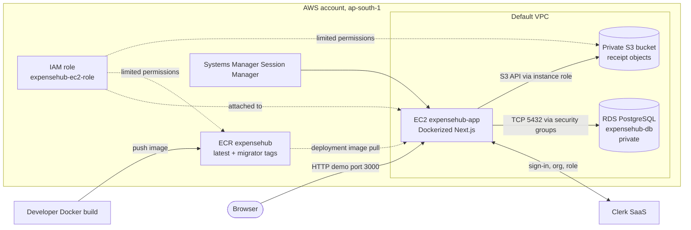

# ExpenseHub on AWS: project summary and demo guide

**Status snapshot: October 5, 2026.** This guide reflects the repository and the team's reported AWS setup. ExpenseHub runs locally; a receipt was uploaded to S3; and the app and migration Docker images were pushed to ECR. The team reports that RDS and EC2 are provisioned. The app has **not yet been pulled onto EC2, connected to RDS, or verified as a live AWS website**. Recheck the AWS console before presenting resource status.

## 1. Project in brief

ExpenseHub is a multi-tenant SaaS expense tracker built with Next.js, React, TypeScript, Clerk, Drizzle ORM, and PostgreSQL. Multiple organizations use the same application and database table. Server-side rules scope each organization's expense data to its members. Organization admins can see and delete all expenses for their organization; members can see their own expenses. A dashboard shows current-month spending and category totals. Expenses can include a receipt image.

The AWS design uses EC2 for the Dockerized application, RDS for PostgreSQL data, S3 for receipt objects, ECR for Docker images, IAM for machine permissions, a VPC/security groups for network boundaries, Session Manager for server administration, and AWS Budgets for cost alerts. Clerk remains an external SaaS identity provider.

This is a practical demonstration of selected cloud concepts, not an implementation of every syllabus topic. Keep the distinction between **resource created**, **resource tested**, and **application deployed** clear in the presentation.

## 2. Work completed and outstanding

| Component | Status and evidence |
|---|---|
| App | Runs locally at `localhost:3000`; Clerk keys were updated for a new Clerk app. |
| Tenant isolation | Implemented in the app: tenant comes from the Clerk server session, not client input. |
| Docker | Multi-stage Dockerfile and local Docker Compose setup are present. |
| AWS account | Team reports Mumbai region (`ap-south-1`), paid plan, root MFA, IAM user `vedanti-dev`, AWS CLI access, and a $5 monthly budget alert with $120 credits. |
| S3 | Bucket `expensehub-receipts-vedanti` created. Local receipt upload was verified by listing an object under `receipts/org_.../`. |
| ECR | Private repository `expensehub` created. App image tag `latest` and migration image tag `migrator` both produced successful digest output. |
| EC2 | Team reports `expensehub-app`, x86 Amazon Linux 2023 `t2.small`, attached role `expensehub-ec2-role`, Docker installed, and Session Manager working. Image pull and app start are pending. |
| RDS | Team reports PostgreSQL DB `expensehub-db` in Available status. EC2 connectivity and migrations are pending. |
| Live deployment | Not complete until image pull, security group, runtime config, migrations, app start, and browser test all succeed. |
| Project docs | This guide is AWS-focused. Existing README/architecture/Cloud Build/Ansible materials still have GCP references and need cleanup or a legacy label. |

Informal “percentage complete” estimates are not a deployment test. The key completion proof is an EC2-hosted app that can authenticate, read/write RDS, and upload/view a private S3 receipt.

## 3. Architecture



The diagram describes the **intended connected runtime**. At the status snapshot, S3 upload and ECR pushes are tested. EC2-to-RDS connectivity, migrations, and the app runtime on EC2 still need verification.

### Request/data flow after deployment

1. The browser reaches the Next.js app on EC2.
2. Clerk authenticates the user and supplies the active organization and role.
3. Server code derives tenant identity from the Clerk session.
4. Drizzle sends SQL to PostgreSQL in RDS.
5. Receipt upload is validated by the server and stored as an S3 object under the organization's prefix.
6. The database stores an S3 reference alongside the expense row.
7. On list render, the app checks that the receipt key belongs to the active organization and issues a signed read URL that expires in 15 minutes.

### Image/deployment flow

Developer builds images → pushes them to ECR → EC2 role authenticates and pulls them → migration container updates RDS schema → app container starts with runtime environment variables. ECR stores images; it does not run them. EC2 runs images; it is not the image registry. S3 stores receipt files; it is not the database.

## 4. Application details and where to show them

### Authentication, organizations, and tenant isolation

Clerk manages sign-in, organizations, and membership roles. `src/proxy.ts` protects dashboard routes and redirects users who need authentication or an active organization. `src/types/Auth.ts` defines the `org:admin` and `org:member` roles.

`src/features/expenses/ExpenseTenant.ts` is the server-side tenant resolver. It reads `userId`, `orgId`, and `orgRole` from Clerk's `auth()` session. It does not accept organization identity from a form or URL.

`src/features/expenses/ExpenseQueries.ts` centralizes the row filters. Admins see rows matching the active organization. Members see rows matching both organization and their user ID. Deletes are admin-only and match both expense ID and organization ID. Monthly summaries follow the same visibility rules. This is a shared database/shared table design with application-level isolation; it is not a separate database per organization or database-native row-level security.

Expense forms/actions use Zod validation (`ExpenseValidation.ts`) and server actions (`ExpenseActions.ts`). The server obtains owner and organization IDs from Clerk rather than trusting submitted IDs.

### Database

`src/models/Schema.ts` defines the PostgreSQL expense table: row ID, `organization_id`, `owner_id`, amount, category, optional description, optional receipt reference, expense date, and creation time. An index exists on `organization_id`.

`src/utils/DBConnection.ts` reads `DATABASE_URL`, creates a PostgreSQL connection pool, and gives Drizzle the schema. `drizzle.config.ts` also reads `DATABASE_URL` for migrations. Local Docker Compose uses its own PostgreSQL container and named volume; the AWS target is RDS. RDS is reported Available, but AWS migrations/app connectivity are not yet reported successful.

### Receipt storage

`src/features/expenses/ReceiptStorage.ts` uses AWS SDK v3 (`S3Client`, `PutObjectCommand`, `GetObjectCommand`) and the S3 presigner. With `S3_BUCKET_NAME` set, files go to `receipts/<safe-org-id>/<uuid>.<ext>`. It allows JPEG, PNG, or WebP up to 10 MB. Without the bucket setting, it writes under `public/uploads/receipts` for local use.

The S3 bucket remains private. The app stores an `s3://` reference, checks the tenant prefix before creating a signed read URL, and sets its lifetime to 15 minutes. That expiration applies to the link, not the object; reloading the list creates a fresh URL. On the developer machine, the AWS SDK used the configured developer credentials/provider chain. On EC2, it should use temporary credentials from the attached instance role, not long-lived keys in an env file.

**Code cleanup:** comments in `ReceiptStorage.ts` still mention Google Cloud Storage and Compute Engine. They are stale comments; the implementation now uses S3 and must be described as such.

## 5. AWS services and how to demonstrate them

### S3 — object storage for receipts

- **Role:** unstructured receipt images; independent of app container lifecycle.
- **Resource:** `expensehub-receipts-vedanti`, Mumbai (`ap-south-1`).
- **Access:** developer IAM credentials for local test; EC2 instance role for cloud runtime.
- **Evidence:** team ran `aws s3 ls s3://expensehub-receipts-vedanti/receipts/ --recursive --region ap-south-1` and saw a PNG under an `org_...` key.
- **Demo:** show bucket, region, private access, `receipts/` prefix, and a harmless test file. Do not use a personal/financial receipt. Never make the bucket public.

### ECR — private image registry

- **Role:** keeps versioned container images for EC2 to pull.
- **Resource URI:** `668380482556.dkr.ecr.ap-south-1.amazonaws.com/expensehub`.
- **Tags:** `latest` app and `migrator` database-migration job. Successful digest output confirmed each push.
- **Access:** developer IAM user pushed images; EC2 role needs ECR pull permissions. The EC2 instance must not receive the developer's access keys.
- **Demo:** ECR → Private registry → Repositories → `expensehub` → Images. Explain “Layer already exists” as Docker reusing previously uploaded layers. A final tag digest confirms completion.

### EC2 — virtual compute

- **Role:** runs the app container and one-off migrator container.
- **Reported resource:** `expensehub-app`, Amazon Linux 2023, x86 `t2.small`, Docker installed; no SSH key; Session Manager works.
- **Access:** `expensehub-ec2-role` is attached and should grant limited ECR/S3 operations. Session Manager is the administration path, avoiding an SSH key/inbound SSH rule.
- **Demo:** show instance type, OS/AMI, region, state, role, security group, and Session Manager. Be honest if the image/app is not running yet.

### RDS — managed PostgreSQL

- **Role:** structured expense records and application SQL.
- **Reported resource:** `expensehub-db`, PostgreSQL, Mumbai, status Available.
- **Security:** intended private database; RDS inbound TCP 5432 should name the EC2 app security group `expensehub-app-sg` as source. Never use `0.0.0.0/0` on port 5432.
- **Demo:** show engine/status, endpoint hostname (not password), VPC/security group, and `Publicly accessible: No`. Say “provisioned” until migration and app connection succeed; then say “connected and tested.”

### VPC and security groups — network controls

The team reports EC2 is in the default VPC with `expensehub-app-sg`. A VPC is the account's logically isolated network; security groups are stateful virtual firewalls. The intended path is browser → EC2 app on TCP 3000 for a temporary demo, and EC2 → private RDS on TCP 5432. Restrict temporary port 3000 inbound to the presenter's public IP `/32`, not all addresses. Session Manager replaces SSH for administration. Verify actual rules in the console before presenting.

This does not implement multiple VPCs, VPN, VPC peering, Direct Connect, or a load balancer. HTTP by public IP is a temporary demo endpoint, not production HTTPS architecture.

### IAM — human identity and workload identity

- **IAM user `vedanti-dev`:** human/developer identity used for CLI and resource administration.
- **EC2 role `expensehub-ec2-role`:** machine identity attached to EC2; provides temporary credentials for AWS APIs.
- **Clerk roles:** application roles for end users; they are unrelated to AWS IAM.

Use least privilege and verify actual policy scopes before describing them. Do not store access keys in source, Docker images, or EC2 environment files. For group handoff, create each collaborator their own access rather than sharing a personal key.

### Systems Manager Session Manager

Provides a browser/console shell to EC2 without distributing an SSH private key or opening inbound port 22. It requires appropriate AWS operator permissions and an instance configured for Systems Manager. Show session access, not shell output containing secrets.

### AWS Budgets and cost

The team reports a $5 monthly budget alert and $120 in credits. The alert monitors and notifies; it is **not automatically a hard spending cap**. Billing data/notifications can lag. Credits apply only under AWS terms and eligible charges. Review the live estimate and Billing/Cost Explorer, especially for EC2, RDS, data transfer, and retained storage. Shut down or remove resources when no longer needed, while understanding retained disks/database storage may continue to incur charges.

Budgeting maps to billing/accounting and service management. It is not an SLA. A budget is not an availability commitment.

## 6. Docker flow and local-vs-cloud distinction

The Dockerfile stages are:

1. `dependencies`: Node 24 slim base, copies package manifest/lock file, runs `npm ci`.
2. `migrator`: copies Drizzle config, migrations, and schema; its command is `npx drizzle-kit migrate` and requires runtime `DATABASE_URL`.
3. `builder`: compiles Next.js. The public Clerk publishable key is a build arg. Placeholder values for secret/database variables are build-time validation only; real secrets are runtime values.
4. `runner`: production dependencies and built app; exposes 3000 and starts `npm run start`.

`.dockerignore` excludes `.env*`, source-control metadata, dependency/build folders, local DB files, and local receipt uploads from the build context. The app image and migration image have different jobs: `latest` serves HTTP, while `migrator` exits after applying schema updates.

Local `docker-compose.yml` uses three services: `db` (PostgreSQL 17 with a named volume), `migrate` (one-off job after DB health check), and `app` (port 3000). Compose's private network lets the app address the database as `db:5432`; the host maps it to port 5433 for local tools. This is not the AWS RDS database.

The migration image had an 871.9 MB displayed layer and took time to push. Docker progress reports uncompressed layer sizes; “Already exists” means a layer is reused. The team set Docker daemon `max-concurrent-uploads` to 1 after timeouts, and both image pushes eventually completed. This is an image-transfer issue, not evidence that the app itself is failing.

## 7. Remaining AWS deployment handoff

1. **Pull images in Session Manager.** The EC2 role must allow ECR token and pull operations.

   ```bash
   aws ecr get-login-password --region ap-south-1 \
     | sudo docker login --username AWS --password-stdin \
       668380482556.dkr.ecr.ap-south-1.amazonaws.com
   sudo docker pull 668380482556.dkr.ecr.ap-south-1.amazonaws.com/expensehub:latest
   sudo docker pull 668380482556.dkr.ecr.ap-south-1.amazonaws.com/expensehub:migrator
   ```

2. **Allow EC2 to reach RDS.** Add TCP 5432 inbound to the RDS security group with source `expensehub-app-sg`. Keep RDS private.
3. **Prepare runtime config securely.** The containers need:

   ```text
   NODE_ENV=production
   DATABASE_URL=postgresql://<user>:<url-encoded-password>@<rds-endpoint>:5432/<database>
   CLERK_SECRET_KEY=<secret>
   NEXT_PUBLIC_CLERK_PUBLISHABLE_KEY=<publishable-key>
   S3_BUCKET_NAME=expensehub-receipts-vedanti
   ```

   Put secrets in a root-readable runtime file (e.g. `/opt/expensehub/app.env`, mode `0600`); don't commit or screenshot it. The EC2 role, not an access-key env var, should authorize S3.
4. **Run migration once:**

   ```bash
   sudo docker run --rm --env-file /opt/expensehub/app.env \
     668380482556.dkr.ecr.ap-south-1.amazonaws.com/expensehub:migrator
   ```

5. **Start the app:**

   ```bash
   sudo docker run -d --name expensehub --restart unless-stopped \
     --env-file /opt/expensehub/app.env -p 3000:3000 \
     668380482556.dkr.ecr.ap-south-1.amazonaws.com/expensehub:latest
   ```

6. **Inspect and test:** `sudo docker ps`, `sudo docker logs --tail 100 expensehub`; open `http://<current-EC2-public-IP>:3000`. Public IP can change after stop/start. Restrict port 3000 to the presenter's IP for the temporary demo. Check Clerk's allowed origins/redirect URLs for the deployment address.
7. **End-to-end check:** sign in, select organization, add expense, confirm RDS-backed row, upload a harmless image, verify S3 object under organization prefix, open the receipt link, and check logs. Confirm RDS is not public and only app SG can reach port 5432.

## 8. Syllabus map and honest scope

| Unit | What ExpenseHub connects to | Limitations / topics not implemented |
|---|---|---|
| **I — Introduction** | SaaS app; EC2 IaaS compute; RDS and S3 managed cloud services; public cloud account; cloud-vs-on-prem comparison. | Trends, cloud evolution, Google architecture, cluster/distributed-computing theory, and private/hybrid/community deployments are not implemented. A private RDS endpoint is not a “private cloud.” |
| **II — Virtualization** | EC2 virtual server; Docker container image and runtime. | Docker is not a hypervisor. No KVM/Xen/VMware internals, EC2 migration, autoscaling, ballooning, deduplication, VM replication, or memory virtualization experiment. ECR Docker image is not an EC2 AMI. |
| **III — Cloud services** | Dockerfile, Compose local orchestration, ECR image registry, EC2 run target, AWS Console/CLI. Clerk is SaaS identity. | No App Engine, Cloud Functions, GKE/EKS, Kubernetes, or SOA/Web OS implementation. No automated AWS CI/CD deployment yet. |
| **IV — Cloud storage** | RDS PostgreSQL for structured records; S3 for unstructured receipt objects. | No DynamoDB/Datastore, Bigtable, Spanner, OpenStack, VMware cloud suite, data lake, or Snowflake. |
| **V — Service management** | Shared responsibility discussion, IAM, private storage/database design, budget alert, Docker deployment, CI tooling and Session Manager. | Alert is not a hard cap. Existing Ansible is GCP-oriented. Single EC2/RDS design is not high availability and no SLA target/failover has been tested. |
| **VI — Network/security** | VPC, security groups, private RDS, app ingress, role-based cloud access, Session Manager. | No multi-VPC, VPN, peering, Direct Connect, load balancer, TLS/domain production edge, or autoscaling. |

### Cloud responsibility explanation

AWS is responsible for its facilities, physical servers, and underlying managed-service infrastructure. For EC2, the team is responsible for the guest OS, Docker, app configuration, app code, IAM role scope, network rules, and secrets. RDS shifts database host/OS operations to AWS, while the team remains responsible for credentials, database settings, schema migrations, query behavior, and access paths. S3 shifts object-storage infrastructure durability/availability operations to AWS, while the team configures bucket access, object organization, data handling, and app authorization.

## 9. 10–12 minute demo script

### 0–1 min: introduce architecture

Say: “ExpenseHub is a multi-tenant expense SaaS. We package the app as a Docker image, store that image in ECR, run it on EC2, keep structured expense rows in RDS, and receipt images in private S3. IAM roles and VPC security groups control AWS access. The local app and S3 upload are verified; the final EC2 runtime wiring is the handoff item.”

### 1–3 min: show app

Show local sign-in, active test org, add expense, dashboard summary, receipt link. State that local Compose PostgreSQL is used locally; it is not RDS. Explain that local receipt mode falls back to disk when S3 config is absent.

### 3–6 min: code/Docker tour

Show, in order: `Dockerfile`; `docker-compose.yml`; `ReceiptStorage.ts`; `ExpenseTenant.ts`; `ExpenseQueries.ts`; `Schema.ts`/`drizzle.config.ts`. Explain app image vs migrator image and build-time public key vs runtime secrets. Never open `.env`, `.env.local`, EC2 env file, passwords, or key material.

### 6–10 min: AWS console tour

Show ECR tags → EC2, role, Session Manager → RDS status/private setting → S3 prefix/object → IAM role and security group → budget alert. State explicitly whether the container is running and whether migrations/connectivity were confirmed. Prepare screenshots with secrets hidden as a Wi-Fi fallback. Start stopped resources about 15 minutes beforehand and recheck EC2's current IP.

### 10–12 min: close

Summarize what was verified, list unfinished runtime tasks truthfully, then mention future production improvements: HTTPS/domain, deployment automation, monitoring, backups/restore test, load balancer, autoscaling, and multi-AZ design.

## 10. Suggested PPT outline

1. Project problem and ExpenseHub overview.
2. Product features and user roles.
3. Application architecture and technology stack.
4. Multi-tenancy and server-side authorization.
5. Docker stages and local Compose flow.
6. AWS architecture and each service's role.
7. ECR image journey and app-vs-migrator images.
8. Expense/receipt data flow: RDS, S3, private key prefix, presigned URL.
9. IAM, networking, shared responsibility, and billing controls.
10. Syllabus mapping, deployment status, demo evidence, and future scope.

## 11. Likely professor questions

**Why both RDS and S3?** RDS is relational storage for structured expenses; S3 is object storage for receipt images. The DB stores a pointer to an object.

**Why ECR and EC2?** ECR stores container images. EC2 is compute that pulls and runs them.

**Why a migration image?** It applies schema changes as a one-off step before the new app version depends on them, rather than migrating every time the web process starts.

**How do receipts stay private?** Private S3 object plus application authorization, tenant-prefixed key, prefix check, short-lived signed read URL.

**Why an EC2 role instead of access keys?** The role supplies temporary credentials attached to the machine, reducing long-lived secret handling.

**Is Docker virtualization?** It is OS-level containerization. EC2 is the VM; AWS abstracts the physical host/hypervisor.

**Is it highly available/autoscaling?** No. There is one app EC2 instance and no load balancer/Auto Scaling Group or tested failover.

**Is the app deployed?** Say yes only after the image is running on EC2, migration succeeded, DB operations work, and a browser test succeeds. ECR push alone is not deployment.

**Does a $5 budget alert stop spending?** No. It is a notification unless separate spend controls/actions are configured and verified.

## 12. Final prep checklist

- [ ] Confirm both ECR tags remain in the repository.
- [ ] Pull both images on EC2 using the instance role.
- [ ] Verify RDS endpoint, private setting, and security group source.
- [ ] Run migration and capture success without showing `DATABASE_URL`.
- [ ] Start app container, inspect logs, and test Clerk, RDS, S3, and receipt view.
- [ ] Restrict port 3000 to the demo IP and remove temporary ingress afterwards.
- [ ] Update AWS status text in README and replace/label GCP-era architecture, Cloud Build, and Ansible material.
- [ ] Fix stale GCS comments in `ReceiptStorage.ts`.
- [ ] Create a safe `.env.example` with placeholder values only if desired; the inspected file listing did not show one.
- [ ] Verify AWS role policies and budget facts in the console rather than presenting assumptions as checked details.
- [ ] Remove/stop resources after the project when no longer needed, accounting for storage that may persist.
- [ ] Keep secrets, access keys, database passwords, personal receipts, and sensitive account screens out of slides and screenshots.
